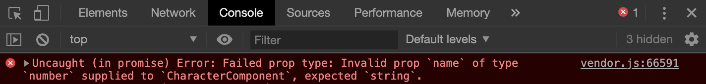

# ember-arg-types

[](https://github.com/jkusa/ember-arg-types/actions?query=branch%3Amain)

Runtime type checking & defaulting for [glimmer component](http://api.emberjs.com/ember/release/modules/@glimmer%2Fcomponent) arguments powered by [prop-types](https://github.com/facebook/prop-types) & decorators.

## Motivation

`ember-arg-types` provides a decorator (`@arg`) that maps [glimmer](http://api.emberjs.com/ember/release/modules/@glimmer%2Fcomponent) arguments to local component properties. This allows default values and type checking to be easily declared (and documented) in your component JS file.

Example:

```js
@arg(string)
sortBy = 'id';
```

Instead of this:

```js
get sortBy() {
  const { sortBy='id' } = this.args;
  assert('`sortBy` must be a string', typeof sortBy === 'string');
  return sortBy;
}
```

## Argument Mapping & Default Values

The `@arg` decorator maps `this.args` values to local component properties. If a mapped argument has a value of `undefined`, `@arg` will return the local property's initializer value.

Here the value of `this.sortBy` is the value of `this.args.sortBy`, unless `this.args.sortBy` is `undefined`. If `undefined`, the value of `this.sortBy` will be `'id'`.

```js
@arg
sortBy = 'id';
```

Here the value of `this.id` is the value of `this.args.id`, unless `this.args.id` is `undefined`. If `undefined`, the value of `this.id` will be computed by the getter.

```js
@arg
get id() {
  return guidFor(this);
}
```

## Type Checking

`ember-arg-types` uses the popular [prop-types](https://github.com/facebook/prop-types) library for runtime type checking.

By importing type validators from [prop-types](https://github.com/facebook/prop-types), you can specify a type check parameter to `@arg`:

```js
import Component from '@glimmer/component';
import { arg } from 'ember-arg-types';
import { string } from 'prop-types';

export default class CharacterComponent extends Component {
  // `name` string arg that is required
  @arg(string.isRequired)
  name;
}
```

### Example Type Check Error

```hbs
{{!-- @name should be a string, not a number --}}
<CharacterComponent @name={{123}}>
```



### Prop Type Docs

You can find more information on `prop-type` validators here: [Prop Type Usage Docs](https://github.com/facebook/prop-types#usage)

### Disable Errors

If an argument value fails a validation check, an `Error` will be thrown (in non-prod environments) by default. To disable throwing `Error`s , update your `config/environment.js` with the following:

```js
'ember-arg-types': {
  // Throw errors instead of logging (default is true)
  throwErrors: false
}
```

## Production

Since component type checks are not typically performed in production, [prop-types](https://github.com/facebook/prop-types) replaces the library with function shims for production builds, resulting in a smaller bundle size.

## Installation

```
ember install ember-arg-types
```

## Usage

### Example Component Definition

```js
// character-component.js

import Component from '@glimmer/component';
import { arg } from 'ember-arg-types';
import { func, number, oneOf, string } from 'prop-types';
import { guidFor } from '@ember/object/internals';

const tunics = ['green', 'red', 'blue'];

export default class CharacterComponent extends Component {
  // `id` string arg with a getter default value
  @arg(string)
  get id() {
    return guidFor(this);
  }

  // `name` string arg that is required
  @arg(string.isRequired)
  name;

  // `title` arg with default value and no type check
  @arg
  title = 'hero';

  // `tunic` arg with set of valid string values and a default
  @arg(oneOf(tunics))
  tunic = tunics[0];

  // `hearts` number arg with default value
  @arg(number)
  hearts = 12;

  // `level` number arg without default value
  @arg(number)
  level;

  // `onClick` action (function) arg with noop default value
  @arg(func)
  onClick = () => null;
}
```

```hbs
{{!-- character-component.hbs --}}

{{!-- args are mapped to local properties, thus we use this.<argName> instead of @<argName> --}}
<div class="character" role="button" {{on "click" this.onClick}}>
  <div class="id">{{this.id}}</div>
  <div class="name">{{this.name}}</div>
  <div class="title">{{this.title}}</div>
  <div class="tunic">{{this.tunic}}</div>
  <div class="hearts">{{this.hearts}}</div>
  <div class="level">{{this.level}}</div>
</div>
```

### Example Component Invocation

```hbs
<Character
  @name="link"
  @title="hero of time"
  @level=2
  @onClick={{this.onClick}}
/>
```

## Compatibility

- Ember.js v3.8 or above
- Ember CLI v2.13 or above
- Node.js v8 or above

## Contributing

See the [Contributing](CONTRIBUTING.md) guide for details.

## License

This project is licensed under the [MIT License](LICENSE.md).
